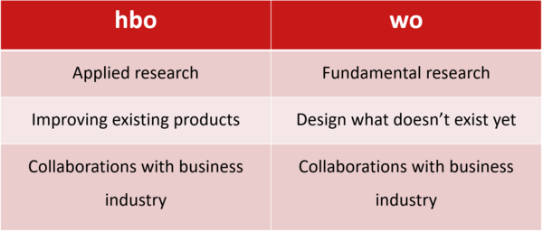
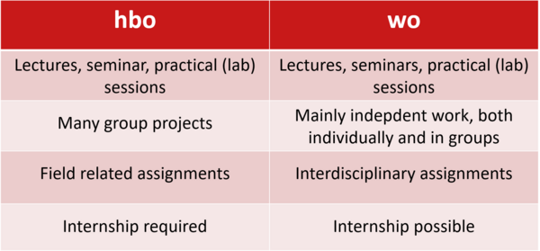
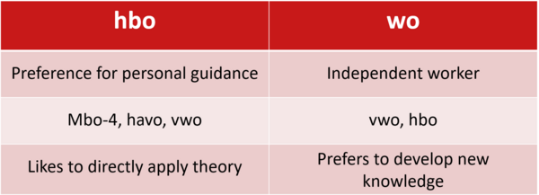

# اپلای برای کارشناسی

## HBO یا WO، کدام مناسب من است؟
همانطور که قبلا اشاره شد، دانشگاه ها در هلند به دو نوع Research University و University of Applied Sciences تقسیم می شوند. دانشگاه های ریسرچ در مقطع کارشناسی دیپلم WO را ارائه می دهند در حالی که در دانشگاه های اپلاید ساینس دانشجو بعد از اتمام دوره دیپلم HBO را دریافت می کند. هدف این بخش معرفی تفاوت های این دو برای تصمیم گیری بهتر است.

:::warning توجه
مثل بخش های دیگر که بحث تصمیم گیری مطرح است، از خواننده تقاضا می شود به محتویات این صفحه اکتفا نکند و تحقیقات خود را انجام دهد. میتوانید در گروه های تلگرام یا  سایر شبکه های اجتماعی با سایر کسانی که در حال تحصل در هر کدام از این دو دوره هستند صحبت کنید و تجربیات آن ها را نیز مد نظر قرار دهید.

مطالبی که اینجا آمده صرفا ترجمه و بازنشر توصیه رسمی توسط دانشگاه هاست و شاید در واقعیت امر با آنچه در دوره ها با آن مواجه میشوید متفاوت باشد.
:::

دانشگاه های اپلاید ساینس، دانشجویان خود را برای ورود به بازار کار آماده می کنند، درس های آنها با بازار کار نزدیکی بیشتری دارند و اکثرا یک سال کارآموزی را در برنامه های تحصیلی خود در مقطع لیسانس شامل می شوند.

در مقابل هدف دانشگاه های ریسرچ، تربیت دانشجو برای مطالعات آکادمیک و تحقیقات توصیف شده. بطور عامه از دو کلمه How و Why برای توصیف تفاوت دوره های HBO که در دانشگاه های اپلاید ساینس ارائه می شوند و دوره های WO که در دانشگاه های ریسرچ ارائه می شوند استفاده شده.

از تصاویر زیر میتوانید برای مقایسه این دو نوع دانشگاه استفاده کنید. تمام این تصاویر از این صفحه در وبسایت دانشگاه آیندهوون استخراج شده اند.

جدول زیر تفاوت در هدف دوره های دانشگاه ریسرچ و اپلاید ساینس را نشان میدهد:

طبق این جدول دوره های HBO به تحقیقات کاربردی اختصاص دارد درحالی که دوره های WO به تحقیقات بنیادی در فیلد های مختلف اختصاص دارند. همچنین دانشگاه های اپلاید ساینس دانشجویان خود را با هدف بهبود آنچه قبلا ساخته شده تربیت می کنند در حالی که دانشگاه های ریسرچ به دنبال تربیت دانشجو برای ساخت چیز هایی هستند که وجود ندارند.
بطور کلی هر دو نوع دانشگاه در ارتباط نزدیک با صنعت قرار دارند و با بازار کار در ارتباطند.

جدول بالا هم به بررسی محتوای آموزشی دوره های HBO در مقایسه با دوره های WO پرداخته. طبق این جدول در هر دو دوره، کلاس ها، سمینار ها و آزمایشگاه ها بخش اعظم دوره را تشکیل میدهند.
دوره های دانشگاه های اپلاید بیشتر شامل پروژه های گروهی است در صورتی که دوره های دانشگاه ریسرچ بر کار انفرادی تمرکز بیشتری دارد.
در دانشگاه های ریسرچ پروژه های میان رشته ای زیاد تعریف می شوند در حالی که دانشگاه های اپلاید پروژه های مربوط به رشته را در الویت قرار می دهند.

همچنین آنچه که میتواند در انتخاب شما بسیار تاثیر گذار باشد، آن است که کارآموزی بخش اجباری دوره های HBO است ولی در دوره های WO چنین نیست و صرفا امکان کارآموزی برای دانشجو وجود دارد.

جدول بالا به شما کمک می کند که بین این دو گزینه برای مقطع کارشناسی تصمیم بگیرید. اگر علاقه دارید که بطور شخصی مورد راهنمایی قرار بگیرید و همچنین دوست دارید که بخش تئوری را به کار ببندید شاید گزینه درست برای شما کارشناسی HBO باشد. از آن سمت، اگر خود را فردی مستقل در مطالعه می دانید و همچنین علاقه دارید که به مطالعه دانش تئوری بپردازید و برای گسترش آن تحقیق کنید، دوره مطلوب شما شاید WO باشد.

:::tip نکته پایانی
بطور کلی دوره های WO و دانشگاه های ریسرچ، ارزش و اعتبار آکادمیک بیشتری را دارند و معمولا مقصد اکثریت دانش آموزان ممتاز دبیرستان هستند. پذیرش در این دانشگاه ها نیز معمولا دشوارتر است. اگر قصد ادامه کار یا تحصیل در حوزه های آکادمیک را دارید به این نکته توجه کنید.
:::
