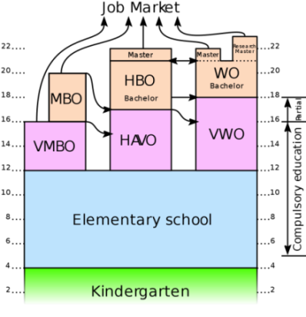

# سیستم تحصیلی هلند

در این نوشته به بررسی سیستم تحصیلی هلند و مقایسه/معادل سازی آن با سیستم تحصیلی ایران می پردازم. آشنایی با مقاطع و درجه های تحصیلی در مدارس و دانشگاه های های هلند برای گرفتن پذیرش(به خصوص در مقطع کارشناسی) بسیار حائز اهمیت است.

در تصویر زیر یک دورنمای کلی از نظام آموزشی هلند ارائه شده. در ادامه به بررسی مقاطع مختلف و معنی هرکدام از بلاک های داخل تصویر میرسیم.

### ابتدایی
کودکان هلندی از چهار سالگی وارد مقطع ابتدایی میشوند و تا 12 سالگی در مدرسه تحصیل می کنند. سال های ابتدایی بیشتر به آموزش جامعه پذیری و رفتار اجتماعی و بعضی مهارت های پایه اختصاص پیدا کرده. یادگیری خواندن و نوشتن از شش سالگی آغاز می شود. تفاوت خاصی از نظر برنامه درسی برای کودکان مختلف وجود ندارد و همگی از یک رویه نسبتا ثابت پیروی می کنند.

برخلاف ایران، کتاب های درسی توسط دولت نوشته یا حتی انتخاب نمی شوند و کتاب درسی واحدی در کل کشور وجود ندارد.

### دبیرستان

دانش آموزان بعد از اتمام مقطع ابتدایی وارد دبیرستان میشوند. در این مقطع دانش آموزان میتوانند سه نوع مختلف تحصیل را در دبیرستان انتخاب کنند تا دیپلم خود را دریافت کرده و به ادامه تحصیل/کاریابی مشغول شوند.

گزینه اول دیپلم VMBO است که دانش آموز با با صرف چهار سال در دبیرستان و در سن 16 سالگی آن را دریافت می کند.
از نظر ادامه تحصیل، دانش آموز با این دیپلم میتواند مستقیم وارد بازار کار شده یا اینکه به دوره های MBO وارد شود.
ارزش تحصیلی دوره های MBO از نظر آکادمیک خیلی بالا نیست و این دیپلم را میتواند معادل کاردانی در نظام آموزشی ایران دانست.
پس از تحصیل در یک دوره MBO اگر دانش آموز بخواهد تحصیلاتش را ادامه دهد، معادل یک دارنده دیپلم HAVO تلقی شده و میتواند به یک دوره لیسانس HBO ورود کند.

گزینه بعدی دیپلم HAVO است. تحصیل در دبیرستان برای دریافت دیپلم HAVO پنج سال و تا سن هفده سالگی ادامه دارد.
پس از دریافت این دیپلم، دانش آموز میتواند به یک دوره لیسانس HBO (معمولا در دانشگاه های Applied Science) ورود کند. 
دوره های لیسانس HBO معمولا چهار سال ادامه دارند که خیلی وقت ها سال آخر به کارآموزی اختصاص پیدا می کند.

:::tip نکته
اگر تفاوت بین دانشگاه های ریسرچ و اپلاید ساینس هلند را نمیدانید، میتوانید از این لینک درباره آنها بیشتر اطلاعات کسب کنید.

بطور خلاصه دانشگاه های Applied Science با هدف آماده سازی دانشجو برای ورود به بازار کار فعالیت می کنند.
دانشگاه های Research برای تربیت دانشجو به منظور ادامه تحصیل و تحقیقات آکادمیک فعالیت کرده و معمولا دوره هایی با بار علمی و تئوری بیشتری در آنها تدریس می شود. 
:::

گزینه سوم برای تحصیل در دبیرستان، دیپلم VWO است که شش سال زمان میبرد و در سن هجده سالگی دانش آموز میتواند به یک دوره لیسانس WO در دانشگاه های ریسرچ وارد شود. دوره های لیسانس VWO معمولا سه ساله هستند.  

بنابراین تعداد زیادی از دانشجویان در 21 سالگی دیپلم کارشناسی خود را دریافت می کنند. این شامل دانشجویانی است که در 17 سالگی با دیپلم HAVO وارد یک برنامه لیسانس 4 ساله HBO شدند یا دانشجویانی که در 18 سالگی وارد یک برنامه لیسانس WO سه ساله شدند.

:::details ورود از مقاطع پایین تر
مطابق آنچه در تصویر آمده، دانش آموزان VMBO و HAVO میتوانند پس از اتمام دیپلم خود، با صرف یک سال تطبیقی(Bridge Year) آنرا به یک دیپلم بهتر ارتقا دهند. برای مثال دانش آموز با دیپلم HAVO می تواند در 17 سالگی پس از دریافت دیپلم خود وارد یک دوره VWO شده و با دو سال تحصیل، دیپلم VWO را دریافت کند.
:::

### دانشگاه

همانطور که قبلا اشاره شد، با توجه به دیپلم دبیرستانی که دانش آموز اخذ کرده، سه مقطع مختلف برای ادامه تحصیل بعد از دبیرستان وجود دارد.
در میان این سه مورد، مقاطع HBO و WO تحصیلات دانشگاهی لیسانس محسوب می شوند.
دانشگاه های ریسرچ دوره های WO و دانشگاه های Applied Science دوره های HBO را برای دانشجویان خود برگزار می کنند. 
توجه داشته باشید که دوره لیسانس برای HBO معمولا چهار سال است ولی برای WO دوره ها اکثرا سه ساله هستند. 

:::details ورود از مقاطع پایین تر
امکان تغییر دانشگاه/دیپم در حین تحصیل برای دانشجویان وجود دارد. دانشجویان MBO می توااند بعد از پایان دوره خود وارد یک دوره HBO شوند. 
دانشجویان HBO هم بعد از یک سال تحصیل امکان ورود به دوره لیسانس WO را دارند.

برای درک بهتر میتوانید به فلش های داخل تصویر بالا دقت کنید.
:::

برای ادامه تحصیل در مقطع فوق لیسانس، دانجشویان دوباره با توجه به مدرک قبلی خود باید اقدام کنند:
دارنده لیسانس HBO از یک دانشگاه اپلاید ساینس میتواند برای دوره مستر در یک دانشگاه اپلاید ساینس یا ریسرچ اقدام کند.
دارنده لیسانس WO از یک دانشگاه ریسرچ هم میتواند برای دوره ارشد وارد یک پروگرام مستر در دانشگاه های اپلاید یا ریسرچ شود.

:::tip نکته
دوره های مقطع ارشد در هلند معمولا دو ساله هستند ولی دوره های یک ساله نیز بصورت فشرده ارائه می شوند که نیازمند تلاش مضاعف و پشتکار بالا هستند.
:::

بطور کلی یک محصل هلندی که بدون وقفه تحصیلات خود را در یک دانشگاه ریسرچ ادامه دهد، در 22 یا 23 سالگی از مقطع ارشد فارغ التحصیل می شود.

از آنجا که برای مقطع دکترا بسته به پوزیشن ها و شرایط فاکتور های زیادی وجود دارد، در اینجا توضیحاتی ارائه نمی شود و در بخش مرتبط میتوانید اطلاعات مربوط به دکترا در هلند را پیدا کنید.